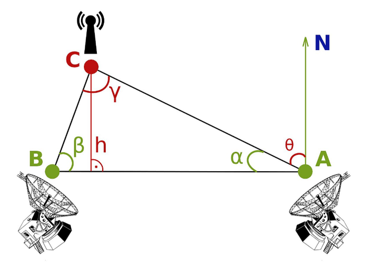

## **Python科学计算编程项目实践任务书**

## **项目名称：外辐射源定位系统模拟**

### **1** **项目背景与目标**

外辐射源定位是电子侦察、无源探测与目标定位中的典型问题。对于未知目标发射的电磁辐射信号，可利用空间分离的多个测向站对目标进行方位测量，并通过方位线交叉实现目标定位。

通过本项目，学生应达到以下目标：

1) 理解外辐射源无源定位的基本原理；

2) 掌握阵列信号建模、波束形成和测向的基本方法；

3) 掌握双站交叉定位的几何计算方法；

4) 具备使用Python进行科学计算与动态可视化开发的能力；

5) 具备分布式仿真系统设计和TCP/IP网络通信编程能力。

### **2项目任务概述**

建立一个双机协同的外辐射源定位仿真系统。

系统由两类节点组成：

**主控节点（机器1）**

- 负责系统参数与调制参数设置；

- 负责目标运动轨迹生成；

- 负责辐射源波形生成；

- 接收两个测向站上传的测角结果；

- 进行双站交叉定位；

- 显示目标真实轨迹与定位轨迹；

- 统计并分析定位误差。

**测向节点（机器2，可逻辑上模拟两个站点）**

- 根据主控节点下发的目标状态和信号参数生成阵列接收数据；

- 分别完成两个测向站的阵列信号处理；

- 实现波束形成、频谱分析、双波束比幅测向；

- 将每个时刻两个站的测角结果通过TCP/IP发送给主控节点。

系统应支持对最多3个不同辐射源同时进行仿真，并动态展示其测向与定位结果。

### **3** **系统功能要求**

**3.1 目标与场景仿真功能**

1) 能够模拟辐射源的二维平面运动轨迹；

2) 支持以下目标运动模式：

- 直线运动；

- 圆弧运动；

3) 圆弧运动的圆心、半径、初始相位等参数可设置或随机生成；

4) 支持同时仿真不少于 **3个** 目标；

5) 每个目标应具有独立的：

- 初始位置；

- 速度方向；

- 运动或轨迹参数；

- 发射频率；

- 调制方式；

- 发射功率或幅度参数。

**3.2 信号生成功能**

1) 能够模拟辐射源发射的电磁信号波形；

2) 调制类型可配置，至少支持以下几种：

- 单频连续波（CW）；

- 调幅（AM）；

- 调频（FM）；

3) 波形参数可设置，包括但不限于：

- 载频；

- 采样率；

- 带宽；

- 调制频率；

- 信号时长；

4) ·可叠加外部随机噪声，噪声强度或信噪比可设置；

5) ·支持多个辐射源信号的叠加仿真。

**3.3 阵列接收与信号处理功能**

1) 每个测向站采用均匀直线阵列（ULA）模型；

2) 阵列单元数支持设置，范围为 8～16个；

3) 能够根据目标方位生成各阵元接收的阵列信号；

4) 能够实现阵列波束形成；

5) 能够对波束输出信号进行时域显示；

6) 能够对接收信号或波束输出信号进行频谱分析；

7) 能够实现双波束比幅测向，并输出目标方位估计值；

8) 单站测向结果应包含：

- 站点编号；

- 时间戳；

- 目标编号；

- 测角值；

- 幅度或信噪比信息。

**3.4 双站定位功能**

1) 系统应利用两个测向站的测角结果进行交叉定位；

2) 能够计算目标在二维平面中的估计位置；

3) 能够同时显示：

- 真实轨迹；

- 交叉定位结果轨迹；

**3.5 动态显示与交互功能**

系统应具有图形界面或可视化界面，至少动态显示以下内容：

1) 目标真实运动轨迹；

2) 目标估计定位轨迹；

3) 两个测向站的位置和阵列朝向；

4) 每个时刻两个站的测角结果；

5) 波束输出时域波形；

6) 波束输出频谱；

7) 定位误差随时间变化曲线；

8) 关键系统参数设置界面或配置文件读取功能。

**3.6 误差统计分析功能**

1) 能够计算每个时刻的定位误差；

2) 能够统计以下指标：

- 最大误差

- 均方根误差（RMSE）

3) 支持生成误差统计图表。

### **4. 技术指标要求**

**4.1 场景参数要求**

1) 目标数量：1～3个；

2) 目标速度范围：**5 km/h ～ 60 km/h**；

3) 目标到两个站点的距离范围：**20 km ～ 60 km**；

4) 两个站点阵列中心距离：**15 km ～40 km**，可；

5) 两个站点阵列朝向相差：**45°～ 90°**；

6) 单站可测角范围：**-60° ～ +60°**；

7) 仿真平面为二维平面坐标系。

**4.2 信号处理指标要求**

1) 阵列单元数：**8～16** 可调；

2) 数据更新时间：**0.5 s/次**；

### **5** **其它要求**

1. 开发语言：Python；

2. 系统应具备良好的模块化结构；

3. 各模块之间接口清晰，便于调试与扩展；

4. 代码应具有必要注释和文档说明。

注：阵列及测角相关计算公式和数学原理参见附录。

